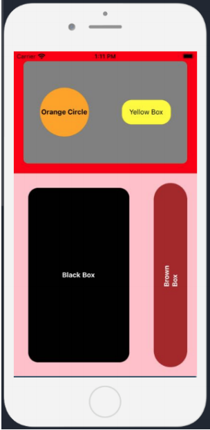

# Assignment

## Description

Project aims to create flex layout with React Native.

## Problem Statement

- Time to put your newly learned skills to work!

- To learn React Native Flex.

## Expected Outcome

## Steps to Solution

- Step 1: Create project folder for local public repo on your pc

- Step 2: Create Flex Layout Page with React Native.

- Step 3: Share your website link.

##  Outcome

- GitHub repo link : 🔥 [GitHub](https://github.com/businan/flex_with_RN) 🔥

- Expo website link : 🔥 [Expo](https://snack.expo.io/jqbXQHh3y) 🔥

**
&#9786; Happy Coding &#9997;
**